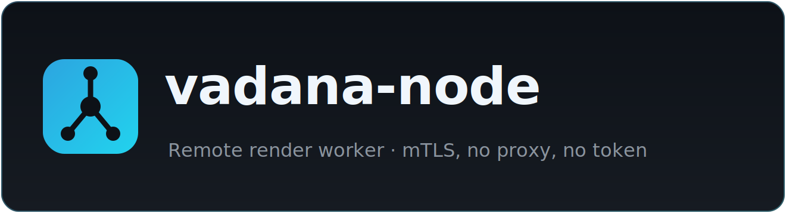

<div align="center">



<br />

**یک نودِ سبک که ساختِ ویدیوهای سنگین را برای مسترِ [vadana-extractor](https://github.com/phoseinq/vadana-extractor) به عهده می‌گیرد.**

<br />

[](https://github.com/phoseinq/vadana-node/actions/workflows/ci.yml)
[](https://github.com/phoseinq/vadana-node/releases)
[](https://github.com/phoseinq/vadana-node/pkgs/container/vadana-node)
[](LICENSE)

<br />

[English](README.md) · **فارسی**

</div>

<br />

<div dir="rtl" align="right">

## 🧩 این چیست

مسترِ وادانا (همان رباتِ تلگرام) ویدیوی کلاس می‌سازد. وقتی اسلاتِ ویدیوی خودش پر است، کار را روی **TLSِ دوطرفه (mTLS)** به یک نودِ کارگر می‌سپارد. نود **نه پروکسیِ ایران دارد نه توکنِ تلگرام** — مستر هرچه لازم است (پکیجِ ضبط + PDFهای اشتراکی، در یک باندل) را می‌فرستد، نود رِندر می‌کند و MP4 را برمی‌گرداند. پس نود فقط CPU و ffmpeg است.

اگر هیچ نودی وصل نباشد، مستر خودش همه‌چیز را می‌سازد — هیچ تغییری نمی‌کند.

<br />

## 🚀 راه‌اندازیِ یک نود

**۱) روی مستر** کافیه `vadana` را بزنی، بروی منوی **Workers** (کلیدِ `n`)، گزینهٔ **add** — اسمِ نود را می‌پرسد، IPِ سرور را خودش پیدا می‌کند، و یک **باندلِ ثبت‌نام** چاپ می‌کند: یک خطِ base64 که CA، گواهی/کلیدِ همان نود و آدرسِ مستر در آن است. هر وقت خواستی دوباره نشانش بده با **show enrollment bundle**.

> یا با دستور: `vadana node add <name>` (آی‌پیِ مستر خودکار پیدا می‌شود).

**۲) روی ماشینِ نود** یک دستور (می‌پرسد داکر یا دستی):

```bash
curl -fsSL https://raw.githubusercontent.com/phoseinq/vadana-node/main/install.sh | bash
```

باندل را که خواست paste کن؛ نصب‌کننده گواهی‌ها را می‌نویسد، **ایمیجِ آماده را pull می‌کند** (داکر) یا venv می‌سازد (دستی)، ورکر را بالا می‌آورد و لاگ را نشان می‌دهد.

**مدیریت** با `vadana-node` — چه نصبِ داکری چه دستی، دستورها یکی‌اند:

```bash
vadana-node                 # interactive menu
vadana-node enroll          # paste a bundle to enroll / replace the certificate
vadana-node test            # verify the mTLS handshake
vadana-node logs            # follow the worker logs
vadana-node update          # pull the latest image (Docker) / git-pull + restart (native)
vadana-node workers 3       # run N parallel workers
```

روی مستر `vadana node status` به‌صورتِ زنده نشان می‌دهد کدام ورکرها وصل‌اند.

<details><summary><b>داکر: pull به‌جای build</b></summary>

<br />

ورکر ایمیجِ منتشرشدهٔ `ghcr.io/phoseinq/vadana-node:latest` را اجرا می‌کند (CI روی هر ریلیز پوش می‌کند)، پس آپدیت فقط pull است — بدونِ build:

```bash
docker compose pull && docker compose up -d      # or simply: vadana-node update
```

`build:` هم در compose به‌عنوانِ fallbackِ محلی می‌ماند (`docker compose up --build`).

</details>

<br />

## ✅ پیش‌نیازها

- **داکر** (پیشنهادی) — یا برای نصبِ دستی: پایتون **۳.۱۱+** با `ffmpeg`/`ffprobe` روی `PATH`
- دسترسی به پورتِ node-APIِ مستر (پیش‌فرض `8443`)
- باندلِ ثبت‌نام از `vadana node add`

<br />

## 🔐 گواهی و کلید چطور؟

دستی با `openssl` کاری نداری — همه را CLIِ مستر انجام می‌دهد:

- **مستر همان CA است.** `vadana node init` فایل‌های `ca.crt` و `ca.key` را می‌سازد (کلیدِ CA هیچ‌وقت از مستر خارج نمی‌شود) و گواهیِ سرورِ خودِ مستر را.
- `vadana node add <name>` برای آن نود یک **گواهی + کلیدِ کلاینت** صادر می‌کند که با CA امضا شده، و اثرانگشتش را به allowlistِ مستر اضافه می‌کند.
- مستر، CA و گواهی/کلیدِ آن نود و آدرسش را در **یک باندلِ ثبت‌نام** (یک خطِ base64) بسته‌بندی می‌کند. همان یک رشته را روی نود paste می‌کنی — چیزِ دیگری برای کپی نیست.
- موقعِ اتصال (mTLSِ دوطرفه): نود با `node.crt`/`node.key` خودش را اثبات می‌کند و مستر را با `ca.crt` وریفای می‌کند؛ مستر هم گواهیِ نود را با CA **و** allowlist چک می‌کند. ابطال هر وقت: `vadana node remove <name>`.

نود جز گواهی/کلیدِ خودش هیچ رازی ذخیره نمی‌کند.

</div>

<br />

---

<div align="center"><sub>MIT · ساختهٔ <a href="https://github.com/phoseinq">phoseinq</a></sub></div>
